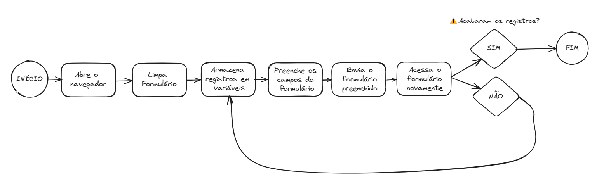

# Projeto - Preenchimento de Leads utilizando Python

Este projeto foi feito para estudo, onde é simulado uma base em Excel com dados de leads fictícios e o script em Python faz o preenchimento dos dados em um Google Forms.

# Formulário
O formulário está disponível em: **https://forms.gle/2zjafKkonbV7AEA66**

# Bibliotecas utilizadas

| Biblioteca | Utilização |
|------------|:----------:|
| **Webbrowser** |Abertura Navegador|
|    **Time**    |Gerar uma pausa no código|
|   **Pandas**   |Leitura da base|
| **PyAutoGUI**  |Execução da automação|

# Processo
1. Script abre o navegador
2. Limpa o formulário para evitar erros
3. Armazena os registros em variáveis
4. Preenche os campos do formulário
5. Envia o formulário preenchida
6. Acessa o formulário novamente
7. Recomeça o script a partir do passo 3 até preencher todos os registros

# Desenho do processo
Desenho feito utilizando o site **Excalidraw**

 